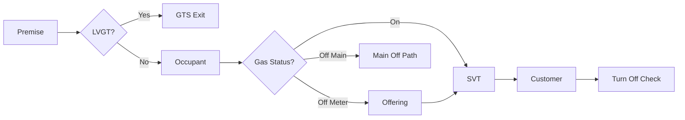
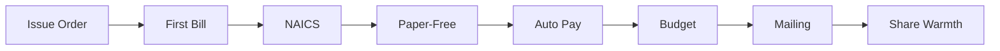
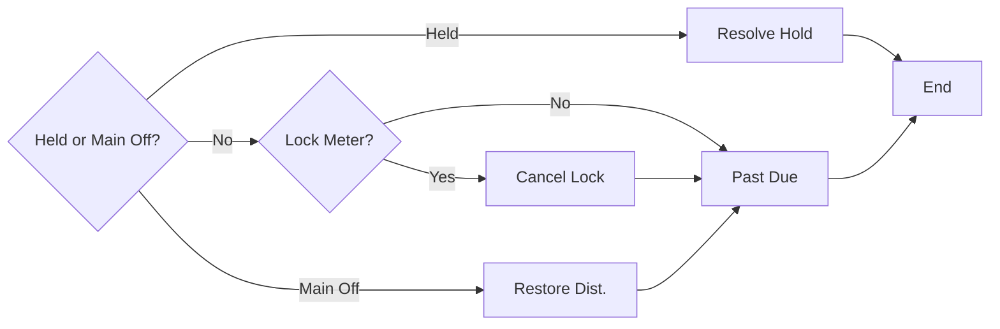

# Turn On PGL NSG

## Applies To

- Utilities: NSG, PGL
- Audience: Complex - Residential Billing, Contact Center, Credit - Collections

## Description

Turn On is issued to initiate billing for a customer.

> Note: If customer of record or third party requests to put service in the name of a revocable trust or irrevocable trust, refer to [Customer Confidentiality](https://ole.wecenergygroup.com/sites/OLE/OLEV2/Pages/Customer-Confidentiality.aspx).

> Note: If customer mentions the customer of record is deceased, refer to [Customer of Record is Deceased](https://ole.wecenergygroup.com/sites/OLE/OLEV2/Pages/Customer-of-Record-is-Deceased.aspx).

> Note: If the Gas On tab indicates meter is inactive and not locked, but Order History or the customer indicates the meter was turned off, do not schedule the order for an all-day appointment. Call the Escalation team or a Team Leader to have the account fixed.

> Note: There is no limit to the number of accounts that can be handled on a call. It is the goal to resolve all customer inquiries during the first contact. However, if the customer has six or more [Turn On](https://ole.wecenergygroup.com/sites/OLE/OLEV2/Pages/OleV2-Index.aspx?guid=fedc1c66-d29c-4f51-b3b7-9a8d93d941ff&pn=Start%20Service) or [Turn Off](https://ole.wecenergygroup.com/sites/OLE/OLEV2/Pages/Turn%20Off.aspx) requests, advise the customer that the process time for the requests will be lengthy. Offer the option of using the company's website or e-mail. Refer to [Handle Multiple Accounts](https://ole.wecenergygroup.com/sites/OLE/OLEV2/Pages/Handle-Multiple-Accounts.aspx).

## Turn On Frequently Asked Questions

### Can a Turn On request be created by anyone other than customer of record?

No. Only customer of record or related contract customer (Y, Y) can request a Turn On. Refer to [Customer Confidentiality](https://ole.wecenergygroup.com/sites/OLE/OLEV2/Pages/Customer-Confidentiality.aspx).

### Can an owner agreement be set up by information provided by the tenant?

No. Owner agreements must be set up directly with the owner or landlord.

### If a customer record exists but the customer is requesting service for a different utility, can the same record be used?

No. A new customer record must be created as part of the Turn On.

Examples:

- Customer record exists for WPS and customer is requesting service for UMERC (WPS), and vice versa.
- Customer record exists for NSG and customer is requesting service for PGL, and vice versa.
- Customer record exists for MERC and customer is requesting service for MGU, and vice versa.
- Customer record exists for UMERC (WE) and customer is requesting service for UMERC (WPS), and vice versa.
- Customer record exists for WE and customer is requesting service for WPS, and vice versa.

When the new customer record is created, enter a comment indicating the utility for which the record was created in the Alert attribute field.

> Example: "CUST # for UMERC accounts."

### Do technicians carry ladders to light overhead and/or rooftop heating units?

- Technicians will check rooftop or attic units if there is a safe foldout staircase or built-in stairwell.
- Some technicians have 6-foot ladders to access overhead appliances.
- If a customer needs a technician with a 10-foot ladder, which is the limit, a limited crew with these ladders can make the stop if known in advance.
- For any other circumstances, meet the customer's contractor or maintenance person and provide gas while they light or check appliances.
- NSG only: The company has some 20-foot extension ladders and technicians occasionally go on some roofs based on a mutual decision between the technician and supervisor.
    - NSG does not recommend this option.
    - A technician shall not lean an extension ladder against a hanging unit when the hanging unit is the only support for the upper half of the ladder.
    - A technician shall not use an extension ladder alone. Another employee is required at the base of the ladder to hold and steady it.

## Process

### Part 1

### Part 2

### Part 3

### 1. Locate the premise where the applicant is requesting service.

> Note: Refer Turn On requests for the City of Chicago to the City of Chicago General Service Department at (312) 744-1256.

1. [Locate a Premise](https://ole.wecenergygroup.com/sites/OLE/OLEV2/Pages/Locate-a-Premise.aspx).
2. Locate the premise the customer is moving to by address information.

> Note: If more than one premise is located for an address, verify which accounts or meters they are responsible for, and repeat the Turn On process for all services at that premise.

> Note: Avoid using the wildcard. Ask the customer for the full address. Refer to [Avoid a Switched Customer Situation](https://ole.wecenergygroup.com/sites/OLE/OLEV2/Pages/Avoid-a-Switched-Customer-Situation.aspx).

> Note: Do not select the Service Pipe Premise Type.

> Note: If still unable to locate the premise, refer to [Add a New Premise During Turn On](https://ole.wecenergygroup.com/sites/OLE/OLEV2/Pages/add-new-premise-during-turn-on.aspx).

3. From the Premise window, select the Contract History tab.
4. Select the ACTIVE or most recent finalled contract to issue the Turn On, then select Details.
5. Review the Contract Overview window for the active or most recent finalled contract.
6. Verify whether the account is on Large Volume Gas Transportation (LVGT).
    - View the Transportation Status Type attribute on the Contract Overview window or the Offering field on the Services tab.
    - If LVGT, transfer the call to Gas Transportation Services (GTS) at (800) 264-8026 and exit the procedure.
    - If not LVGT, proceed to Step 2.

### 2. Determine if Occupant Use exists or if the most recent customer has indication of theft or steal.

1. [Determine Occupant Use](https://ole.wecenergygroup.com/sites/OLE/OLEV2/Pages/Determine-Occupant-Use.aspx).
    - Make note of whether Occupant Use exists to determine how to proceed with Adverse Premise Search as part of the Contract Application.
2. Locate the most recent account at the premise.
    - On the Premise tab, select Premise Details.
    - Select the Contract History tab.
    - Select the Begin Date column to sort in chronological order.
    - Select the most recent contract, then select Details.
3. View the Alert attribute and contract notes.
    - If theft or steal is indicated in the Alert attribute or contract notes, make note of it to determine how to proceed with Adverse Premise Search as part of the Contract Application, then proceed to Step 3.
    - If theft or steal is not indicated, proceed to Step 3.

### 3. Determine if gas is on or off.

1. [Determine if Gas is On or Off](https://ole.wecenergygroup.com/sites/OLE/OLEV2/Pages/determine-if-gas-is-on-or-off.aspx).
2. If gas is on:

> Note: If the Gas On tab indicates meter is inactive and not locked, but Order History or the customer indicates the meter was turned off, do not schedule the order for an all-day appointment. Call the Escalation team or a Team Leader to have the account fixed.

   1. Select the Meter Reading History tab.
   2. If the tab is blank, select Details.
   3. Verify whether the source of one of the last two readings is an Itron or Actual Meter Reading.

> Note: If the status is Failed, it is still a valid Itron or Actual Meter Reading.

   4. Proceed to Step 5.
3. If gas is off at meter, b-box, riser, or the meter is removed, proceed to Step 4.
4. If gas is off at the main, or PGL only with no service pipe:

> Note: A no-service-pipe condition is indicated when the Pipe Serial Number field on the Gas On tab is blank.

    - If it is a North Shore Gas premise, do not issue a Turn On. Proceed to [Restore Service with Distribution](https://ole.wecenergygroup.com/sites/OLE/OLEV2/Pages/restore-service-with-distribution.aspx) and exit the procedure.
    - If it is a Peoples Gas premise, proceed to Step 4.

### 4. Determine if the offering is correct.

1. View Offering on the Services tab.
2. On the Premise tab, select Premise Service Details.
    - Select the Gas Prem Svc Type row, then select Accessories.

> Note: If there is only one Gas Prem Svc Type, the Premise Service window displays. Select the Accessories tab.

    - View the appliances listed.
3. Ask the customer the following:
    - Is the location where you are requesting gas service a house, apartment unit, or business?
    - Will you pay for the heat at this location?
    - Are you the owner of the property?
4. Determine whether the offering is correct based on the customer's response.
    - If correct, proceed to Step 5.
    - If not correct, refer to [Offering Inquiry Process](https://ole.wecenergygroup.com/sites/OLE/OLEV2/Pages/offering-inquiry-pgl%20nsg.aspx), then proceed to Step 5.

### 5. Verify if the current contract is on an SVT rate.

1. Select the Services tab on the Contract Overview window.
2. Determine whether the Offering field displays an SVT offering.
3. If it is an SVT offering:
    - On the Premise tab, select Premise Details.
    - Verify that the Premise Type matches the Contract Type.
    - On the Premise tab, select Premise Service Details.
    - Select the Gas Prem Svc Type row, then select Accessories.

> Note: If there is only one Gas Prem Svc Type, the Premise Service window displays. Select the Accessories tab.

    - Verify that the Premise Use attribute matches the Contract Type and Premise Type.
4. Proceed to Step 6.

### 6. Locate the customer.

> Note: Link customer to existing contracts whenever possible.

1. [Locate a Contract](https://ole.wecenergygroup.com/sites/OLE/OLEV2/Pages/locate-a-contract.aspx) by customer information to determine whether the customer has had an account in their name.
    - Request the customer's full legal name, including middle initial, and social security number (SSN) or Tax ID number.
2. [Locate a Customer](https://ole.wecenergygroup.com/sites/OLE/OLEV2/Pages/locate-a-customer.aspx).

> Note: Customer search locates related customers on a contract or owners that have never had service in their name as a primary customer.

3. When searching:
    - Ask the applicant whether they ever had service and where, to attempt to locate the record.
    - Check the Include Related checkbox.
    - Search by social security number or Tax ID number first.

> Note: If a customer record is located with a different last name but the same first name, ask whether the customer had a legal name change. If yes, change the last name. Refer to [Name Change Request](https://ole.wecenergygroup.com/sites/OLE/OLEV2/Pages/Name-Change-Requests.aspx). POSID - Enrollment Verification must be performed as part of the Contract Application, regardless of customer type.

4. If no customer record is located with SSN or Tax ID, use wildcard (*) to search by name.
5. If the customer is located:

> Note: If a customer record already exists but for a different utility, a new customer record must be created. Follow the not-located path below to add a new customer as part of the Turn On order.

   1. If multiple customer numbers are returned, select the customer number with the most accounts or sequences.
   2. Review the list returned to determine whether the customer has active accounts.
            - If the customer has active accounts, determine whether a Turn Off order is needed for transfer service. If yes, refer to [Transfer Service](https://ole.wecenergygroup.com/sites/OLE/OLEV2/Pages/Transfer-Service.aspx).
            - If there are no active accounts, select the highest-sequence account and view the Turn Off date on the Services tab.
   3. If the account is going into a customer's personal name, determine and make note of [customer type](https://ole.wecenergygroup.com/sites/OLE/OLEV2/Pages/Contract-Application.aspx).

> Note: The bypasses listed do not apply to accounts in the name of legal entities such as LLC, CORP, INC, LTD, or LLP.

   4. Verify identification currently on file. Refer to [Verification Guidelines](https://ole.wecenergygroup.com/sites/OLE/OLEV2/Pages/verification-guidelines.aspx).
   5. [Modify Customer Information](https://ole.wecenergygroup.com/sites/OLE/OLEV2/Pages/Modify-Customer-Information.aspx).
   6. Update the following required information:
            - Full legal name, including middle initial.
            - Previous address, using a physical address and not a P.O. Box.
            - Enter the address in the Previous Address, Previous City Address, Previous State Address, and Previous Zip Code attribute fields.

> Note: If the customer provides a foreign address, do not enter information in those fields. Leave them blank and add previous address details in a [contract note](https://ole.wecenergygroup.com/sites/OLE/OLEV2/Pages/Add-a-Note.aspx).

   7. If missing, attempt to gather other forms of acceptable identification information from the verified customer.

> Note: Do not modify existing information for the following:
>
> - Social Security number or last four digits
> - Date of birth
> - Valid driver's license and issuing state, or state-issued ID and issuing state

   8. Update Contact Methods. Refer to [Telephone Number and E-mail Verification](https://ole.wecenergygroup.com/sites/OLE/OLEV2/Pages/Telephone-Number-and-E-mail-Verification.aspx).
            - Verify or update phone numbers.
            - Required: Ensure there is a default phone number listed. If no number exists or the customer does not want a number listed, enter all 9s.
            - Request or update e-mail address.
   9. Make note of any past due or charge-off balances the customer owes and the contract numbers, which are the customer number plus sequence number.
   10. Proceed to Step 7.
6. If the customer is not located, proceed to Step 7.

> Note: The customer will be created as part of the Turn On order.

### 7. Determine if an In Progress Turn Off order exists.

- If the Turn Off is scheduled for an earlier date than the Turn On request:
    - Example: Turn Off pending for 2/24 and the customer requests Turn On for 2/28.
    - Proceed to Step 8.
- If no Turn Off exists, proceed to Step 8.
- If the Turn Off is scheduled within 2 days of the Turn On request, or more than 2 days after the Turn On request:
    - Example: Turn Off for 2/28 and the customer requests Turn On for 2/26.
    - Example: Turn Off pending for 2/28 and the customer requests Turn On for 2/21.
    - Proceed with Turn On for the same day as Turn Off.

> Note: If the Turn On order is held, Turn Off will be executed following the normal process.

    - Advise the customer a Turn Off is scheduled for the applicable date and service will start in their name on the same date.
    - Proceed to Step 8.

### 8. Issue Turn On order.

> Note: If there is a pending Turn On with a Wanted date 30 days out and an open Backdated Turn On or Turn Off work item, cancel the future-dated Turn On, issue the Turn On for the new party, and update the work item to indicate the Turn On was cancelled.

1. On the Orders tab, select Issue Turn On.
    - The Issue Orders window displays.
    - Make note of the meter location in the informational message.
    - Select OK.

> Note: Order Category and Order Type will prepopulate.

    - Select Turn On/Off from the Order Category drop-down list, if necessary.
    - Select Turn On from the Order Type drop-down list, if necessary.

> Note: If the message "The Adverse Conditions reason is Name Switching, Pending Non-Pay Shut off or Other" displays, [complete these steps](https://ole.wecenergygroup.com/sites/OLE/OLEV2/Pages/Turn-On-PGL-NSG.aspx).

    - Select Customer Request from the Reason drop-down list, if necessary.
    - Select Apply, if necessary.
2. Select the ellipsis (...) button next to the Customer field.
    - Search for an existing customer.
    - Or select Add to create a new customer. Refer to [Create a New Customer Record](https://ole.wecenergygroup.com/sites/OLE/OLEV2/Pages/Create-a-New-Customer-Record.aspx).
3. Select the appropriate option from the Contract Type drop-down list.

> Note: This selection should match the Contract Type from the Contract Details window.

4. Select New.
    - The Contract Application window displays.
    - Proceed to [Contract Application](https://ole.wecenergygroup.com/sites/OLE/OLEV2/Pages/contract-application.aspx).

> Note: All steps of the Contract Application on the Verification tab must be completed as documented. At the end of the process, refer to Step 16 to advise the customer of any required follow-up actions.

    - Select Apply.
5. On the Services tab, select the Gas Service Type checkbox.

> Note: Gas Service Status may display Locked (Cut off at Main).

    - If it is a master meter, set in battery, select both Gas Service checkboxes.
    - If the offering for the Gas Service Type is an SVT rate, [Configure an Offering at Turn On](https://ole.wecenergygroup.com/sites/OLE/OLEV2/Pages/configure-an-offering-at-turn-on.aspx).

> Note: The Offering field should default to the best rate for the premise type.

    - Select Apply.
6. Select the Scheduling tab.
    - Select the plus (+) for each Service Type to display details.
7. Enter the following in the Wanted Date field:
    - If gas is not off at the main, ask the customer when they accept responsibility and select the customer's responsibility date.
    - Ask: "What date is your lease or ownership effective?" or "What date will you be responsible for the service?"
    - Once the date is provided, inform the customer: "In order to turn on gas service, we will need to send a service technician to your location. I can provide available dates and times for this request."
    - If gas is on, ask the customer when they accept responsibility and select the customer's responsibility date.
    - If the date is in the past or the meter is inactive, refer to [Backdated Turn On or Turn Off](https://ole.wecenergygroup.com/sites/OLE/OLEV2/Pages/backdated-turn-on-or-turn-off.aspx).
    - If the order requires a field service visit, inform the customer: "In order to place the gas service in your name, we will need to send a service technician to your location. I can provide you with the available dates and times for this request."
8. Allow [Completion Method](https://ole.wecenergygroup.com/sites/OLE/OLEV2/Pages/Orders-Functionality-Overview.aspx) to default.
    - If defaulted to Auto Complete, determine soft close eligibility. Refer to [Soft Close](https://ole.wecenergygroup.com/sites/OLE/OLEV2/Pages/Soft-Close.aspx).
    - If the order should be soft closed, leave it defaulted to Auto Complete.
    - If the order should not be soft closed, select Appointment.

> Note: The order should not be soft closed if the customer requests an actual reading.

    - If off at main or no service pipe, select Normal Completion.
9. Select Meter Set/Install from the Install Gas Meter Work Type attribute drop-down list when necessary.
10. Schedule the order if necessary.

> Note: If error message "ERROR: #11008 - Latitude and longitude is required to search for available appointments." is received, [complete these steps](https://ole.wecenergygroup.com/sites/OLE/OLEV2/Pages/Turn-On-PGL-NSG.aspx).

    - Successions only:
        - If soft close eligible except the customer requested an actual reading, and at least one of the last two readings is an Itron reading, schedule an all-day appointment. Do not schedule all-day appointments for Saturday.

> Note: Access is not needed. The meter will be read via van.

    - If not soft close eligible and at least one of the last two readings is an Itron reading, schedule an all-day appointment.

> Note: Access is not needed. The meter will be read electronically. Do not schedule all-day appointments for Saturday.

    - If neither of the last two readings is an Itron reading, schedule an AM or PM appointment unless the meter is outside and accessible.
11. Select Apply.
12. Select the Contact tab.
    - Enter the requester name in the Requested By field.
    - Enter the contact number where the customer may be reached on the day of the scheduled appointment in the Contact Phone field.
13. Advise the customer as follows when a field visit is involved and access is needed:
    - English:
        - "To complete this request, we ask that an adult 18 years of age or older be present to provide access to the premise, gas meter and all natural gas appliances."
    - "Gas service cannot be turned on without access to the meter and natural gas appliances. If this is a multiunit residential or commercial building, your meter and natural gas appliances may require a separate key because they may be located in a restricted area, such as a basement or utility room. Please check with your management company or owner before your appointment so you can provide access to both your meter and natural gas appliances."
        - "For your safety and to ensure a safe working environment for our serviceperson, please secure pets and ensure the serviceperson has a clear path to the premise, meter and appliances."
    - Spanish:
        - "Para completar esta solicitud, pedimos que un adulto mayor de 18 años esté presente para proporcionar acceso a las instalaciones, al medidor de gas y a todos los aparatos de gas natural."
    - "El servicio de gas no se puede activar sin acceso al medidor y a los aparatos de gas natural. Si se trata de un edificio residencial o comercial de varias unidades, es posible que su medidor y sus aparatos de gas natural requieran una llave separada, ya que pueden estar ubicados en un área restringida, por ejemplo el sótano o cuarto de servicio. Por favor consulte con su empresa de administración o propietario antes de su cita para poder proporcionar acceso tanto a su medidor como a sus aparatos de gas natural."
        - "Para su seguridad y para asegurar un entorno de trabajo seguro para nuestros trabajadores, por favor asegure todas las mascotas y asegúrese de que el trabajador tenga un camino claro a la locación, medidor y electrodomésticos."
    - Or advise the following when a field visit is involved and access is not needed:

> Note: Successions only. If the gas is on and at least one of the last two readings is an Itron reading, the meter will be read electronically and access is not needed even if the meter is not accessible.

    - Succession only, van read, day appointment: "<Peoples Gas or North Shore Gas> will be using a service van to read your meter remotely from the street to obtain an actual reading on <date>. You do not need to be home for this electronic meter reading."
        - Succession, meter outside and accessible: "The meter will be read on <date>. A technician will call after the meter has been read to advise that the account is active."
    - "To ensure a safe working environment for our serviceperson, please secure all pets, hazardous material and debris where the serviceperson will be working."
    - Or advise the following when a field visit is not involved, Auto Complete: "A service person will not visit your premises to complete this request."
14. Enter the following in the Instructions field:

> Note: Do not use special characters such as < > ( ) * & - + = ' " # • ! @ $, do not use the Enter key for a hard return, and do not copy, cut, or paste information in order instructions because it displays corrupted and cannot be sent to PCAD.

    - Access instructions to the building, the gas meter, and all gas appliances.
    - Or note that the meter is outside and accessible when access is not needed.
    - Or enter Succession Turn On; read via van when applicable.
    - If the premise meets succession Turn On or van criteria, but the customer indicates gas is off, enter Gas is Off followed by access instructions and any additional information.
    - If gas is off at the main, enter Off at Main and any other pertinent information.
    - If the ERT device is not reading or not installed, enter a comment to change or install ERT.
    - Enter the meter number if the number on the Services tab, or Contract Overview Services tab, does not start with P or N. Refer to [View Associated Device](https://ole.wecenergygroup.com/sites/OLE/OLEV2/Pages/View-and-Associate-Devices.aspx) to locate the meter serial number.

> Note: The Serial Number, which begins with P for Peoples Gas and N for North Shore Gas, is listed on the Premise Service Associated Device List window.

    - Add any additional information.
15. Select the Order Attributes tab and enter or select the appropriate value for the following:
    - Original Requested Date
    - Primary Residence - Order Issue
16. Select the Charges tab and advise the customer of the charge.

> Note: If a customer's service was disconnected at their request and they ask for reinstatement within 12 months at the same location, refer to [Seasonal Reconnect (Turn On)](https://ole.wecenergygroup.com/sites/OLE/OLEV2/Pages/Seasonal-Reconnect-%28Turn-On%29.aspx) to assess the seasonal reconnection charge, divert the bill, and issue a work item to bill the prorated monthly service charge.

17. Select the Quick Launch tab.
    - [Add a Mailing Address](https://ole.wecenergygroup.com/sites/OLE/OLEV2/Pages/add-a-mailing-address.aspx) if the mailing address is different from the service address.

> Note: Add the mailing address while on the Issue Turn On window, including for landlords with an owner agreement.

    - Ask whether the customer would like to add a spouse, roommate, or someone else to the account.
    - Select Related Customer Maint to add a related customer, if applicable.
    - Proceed to Step 3 of [Customer Confidentiality - Related Contract Customer](https://ole.wecenergygroup.com/sites/OLE/OLEV2/Pages/customer-confidentiality.aspx).
    - Select Add from the Contract Related Customer Maintenance window.
18. Select the Owner Agreement History tab and determine whether the contract has an owner agreement.
    - Ask the caller whether they are renting or purchasing the property.
    - If there is an owner agreement, make note of the owner's name and rule, and verify the information is correct.
    - If the information is not correct and the requester is the new owner:
        - [Delete the owner agreement](https://ole.wecenergygroup.com/sites/OLE/OLEV2/Pages/Delete-an-Owner-Agreement.aspx).
    - Ask the new owner whether they would like to establish an [Owner Agreement](https://ole.wecenergygroup.com/sites/OLE/OLEV2/Pages/Owner-Agreement.aspx).
    - If the information is correct and the current owner will occupy the property, meaning it will not be used as a rental, delete the owner agreement.
    - If the information is not correct and the requester is a renter:
        - Ask, "Who are you renting from?"
    - Refer to Step 19.
    - If the information is correct, no action is needed.
    - If there is no owner agreement:
        - If the caller is a renter, ask, "Who are you renting from?"
    - Refer to Step 19.
19. Select the Premise Contacts tab to view and update landlord information. Refer to [Add or Update Landlord Information](https://ole.wecenergygroup.com/sites/OLE/OLEV2/Pages/Add-or-Update-Landlord-Information.aspx).
20. Repeat the address and city or town back to the customer to verify the order is created for the correct address.
21. Select OK.

> Note: The following message displays only if the services are currently being billed: "The following services are currently being billed in the indicated contract. Issuing Turn On order will create a Turn Off order for these services. Do you wish to continue?"

> Note: If warning message "WARNING: #11043 - The selected gas service must have an associated service pipe." is received, [complete these steps](https://ole.wecenergygroup.com/sites/OLE/OLEV2/Pages/Turn-On-PGL-NSG.aspx).

> Note: If error message "10212 - Personal Application required" displays, [complete these steps](https://ole.wecenergygroup.com/sites/OLE/OLEV2/Pages/Turn-On-PGL-NSG.aspx).

> Note: If validation error "11477 - State of Customer's Driver's License must be provided" displays, access the customer record and ensure both the Driver's License Number and Driver's License State attributes are updated.

### 9. Advise the customer when to expect the first bill.

1. Provide the customer with the new account number.
2. If the Wanted Date is 10 or more calendar days from the Next Rdg Date on the Services tab, the first bill is generated shortly after the Next Rdg Date.
3. If the Wanted Date is less than 10 calendar days from the Next Rdg Date, the first bill is generated shortly after the following month's reading.
4. Refer to [Turn On First Bill Timeframe Job-Aid](https://ole.wecenergygroup.com/sites/OLE/OLEV2/Documents/Turn%20On%20First%20Bill%20Timeframe%20Job-Aid.pdf) for more details.

### 10. If a non-residential premise, verify and document the nature of the customer's business.

1. Locate the customer's new account. Refer to [Locate a Contract](https://ole.wecenergygroup.com/sites/OLE/OLEV2/Pages/locate-a-contract.aspx).
2. Refer to [Request NAICS Information](https://ole.wecenergygroup.com/sites/OLE/OLEV2/Pages/Request-NAICS-Information.aspx).

### 11. Solicit customer to establish Paper-Free Billing.

1. [Solicit Paper-Free Billing](https://ole.wecenergygroup.com/sites/OLE/OLEV2/Pages/Solicit-Paper-Free-Billing.aspx).

> Note: For Transfer of Service, Paper-Free is not displaying on the Transfer Customer window for enrolled customers. Manually establish Paper-Free on the new account. Refer to [Paper-Free Billing](https://ole.wecenergygroup.com/sites/OLE/OLEV2/Pages/Paper-Free-Billing.aspx).

### 12. Solicit Automatic Payment Plan.

- If the customer enrolls:
    - [Compose a Letter](https://ole.wecenergygroup.com/sites/OLE/OLEV2/Pages/compose-a-letter.aspx).
    - Select Auto Pay Plan Application from the Results group box.
    - Select Next Batch from the Schedule drop-down list.
    - Proceed to Step 13.
- If the customer does not enroll, proceed to Step 13.

### 13. Discuss Budget Billing if requested by the customer.

1. If a customer on an [eligible rate](https://ole.wecenergygroup.com/sites/OLE/OLEV2/Pages/Budget-Billing-Processes.aspx) requests to establish Budget Billing at the time of Turn On, do the following:
    - Advise the customer to enroll after they receive the first bill by using the auto-enroll bill message.
    - Along with the Budget Billing talking points, share the following:
        - The bill message states, "Even out your energy bills! Enroll in Budget Billing by paying exactly <amount>, rather than the amount due shown. This will then be your monthly Budget amount. Every six months, your account will be reviewed and your payment may be adjusted to better reflect your actual use."
    - If the customer insists that Budget Billing be established for them, [Add a Note Follow-up](https://ole.wecenergygroup.com/sites/OLE/OLEV2/Pages/add-a-note-follow-up.aspx) with the following details:
        - Type: Note Follow-up
    - Assign To Work Group: Contact Center
        - Defer Until Date: One business day after the first bill prints
    - Remark: Customer requested Budget Billing at time of Turn On; establish once first bill prints.

### 14. Determine if mailing address should be updated based on the applicant's Wanted date.

- If the Wanted date is within three business days, proceed to Step 15.
- If the Wanted date is four or more business days:
    - Advise the applicant that more information, such as a deposit letter, credit hold letter, or Welcome Kit, may be sent before they move in.
    - Ask whether the applicant would like the information sent to another address.
    - If yes, [Add a Mailing Address](https://ole.wecenergygroup.com/sites/OLE/OLEV2/Pages/add-a-mailing-address.aspx).
    - Effective to: Wanted date.
    - Proceed to Step 15.

### 15. Provide details for Share the Warmth if the customer requests to pledge.

Refer to [Share the Warmth Contribution Information](https://ole.wecenergygroup.com/sites/OLE/OLEV2/Pages/Share-the-Warmth-%28STW%29-Contribution-Information.aspx) and [Pledge Overview](https://ole.wecenergygroup.com/sites/OLE/OLEV2/Pages/Pledge-Overview.aspx).

### 16. Complete follow-up action if the order is held or gas is off at the main.

- If the application is held:

> Note: Follow this step even if gas is off at the main. Held conditions must be resolved first.

    - Advise the customer of the actions needed to resolve the hold. Refer to [Resolve Held Application](https://ole.wecenergygroup.com/sites/OLE/OLEV2/Pages/resolve-held-application.aspx).
    - Exit the procedure.
- If gas is off at the main or there is no service pipe, and the order is not held:
    - Refer to [Restore Service with Distribution](https://ole.wecenergygroup.com/sites/OLE/OLEV2/Pages/restore-service-with-distribution.aspx).
    - Proceed to Step 18.
- If gas is not off at the main and the order is not held, proceed to Step 17.

### 17. If the application is not held, determine if a Lock Meter order exists for Soft Close.

1. [Locate an Order by Contract Information](https://ole.wecenergygroup.com/sites/OLE/OLEV2/Pages/locate-an-order-by-contract-information.aspx).
2. Use the following search criteria:
    - Order Type: Lock Meter
    - Status: In Progress
3. Select the order, then select History.
4. View the Issue Service Order line to determine whether the reason is Soft Close.
5. If the order exists:
    - [Cancel an Order](https://ole.wecenergygroup.com/sites/OLE/OLEV2/Pages/cancel-an-order.aspx).
    - Remarks: Turn On issued; not held.
    - Proceed to Step 18.
6. If the order does not exist, proceed to Step 18.

### 18. Residential only: Solicit payment for any past due balance if the order is not held.

- If the customer agrees to pay the entire past due balance:
    - Transfer the call to Bill Matrix to make payment. Refer to [Quick Payment Process](https://ole.wecenergygroup.com/sites/OLE/OLEV2/Pages/quick-payment-process.aspx).
    - Exit the procedure.
- If the customer does not agree to pay the full past due balance:
    - Transfer the call to Bill Matrix to make a partial payment, if necessary. Refer to [Quick Payment Process](https://ole.wecenergygroup.com/sites/OLE/OLEV2/Pages/quick-payment-process.aspx).
    - If the customer is unable to make a payment, advise that the balance of <amount> will be transferred to their active account and will be reflected on the first bill.
    - Encourage the customer to make payments and, if a balance remains after the first bill is received, to contact the company to establish a payment arrangement.
    - [Add a Contract Note](https://ole.wecenergygroup.com/sites/OLE/OLEV2/Pages/add-a-note.aspx) including the following in the New Remarks field:
        - Advised customer of <amount> past due or written off.
    - Any payment arrangements discussed with the customer.
    - [Add a Note Follow-up](https://ole.wecenergygroup.com/sites/OLE/OLEV2/Pages/add-a-note-follow-up.aspx).
        - Type: Credit Call F/Up - Residential
    - If past due balance is not written off or assigned to a collection agency:
            - Assign To Work Group: Contact Center
            - Reserve to User: Assign to Team Lead or AVP
    - If past due balance is written off or assigned to a collection agency:
            - Assign To Work Group: Credit
    - Defer Until Date: Two days after Turn On date
        - Remark: Transfer debt from <old or prior account number> to <active account number>.
    - Exit the procedure.

## Related Links

- [Handle Multiple Accounts](https://ole.wecenergygroup.com/sites/OLE/OLEV2/Pages/handle-multiple-accounts.aspx)
- [Order Category and Type PGL NSG](https://ole.wecenergygroup.com/sites/OLE/OLEV2/Pages/Order-Category-and-Type-PGL-NSG.aspx)
